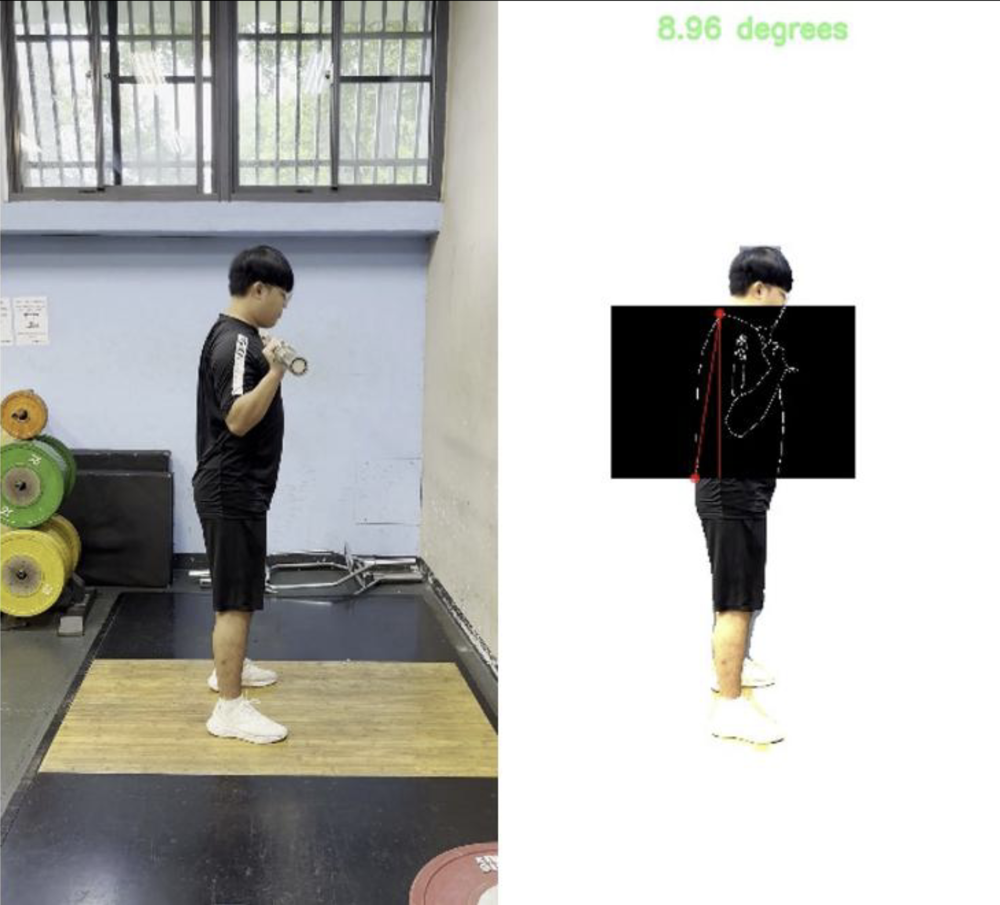
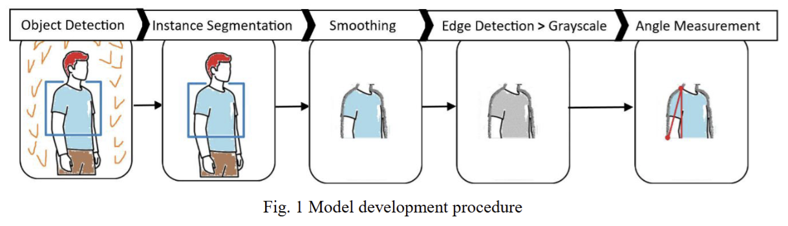
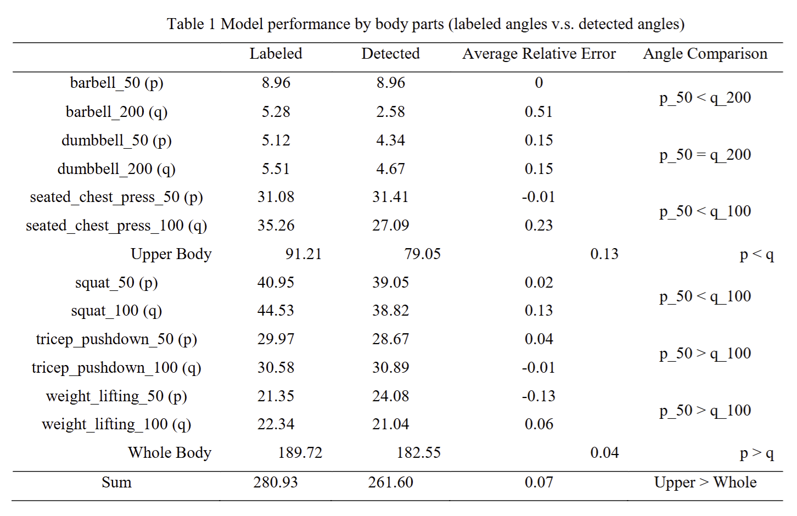
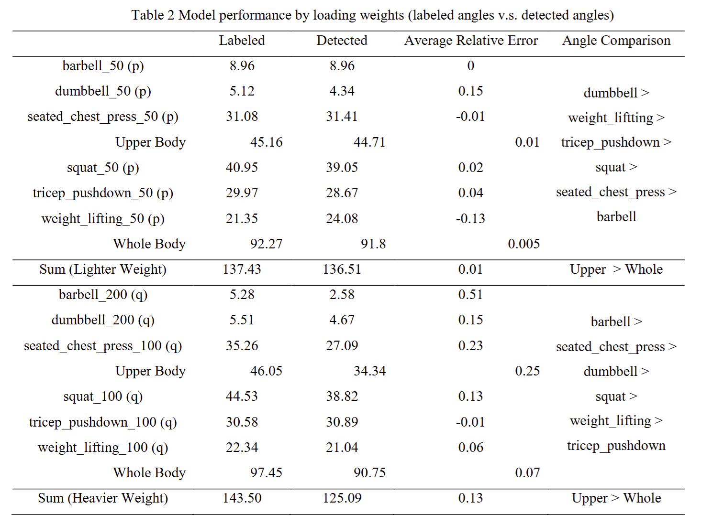

# 🏋️ Real-Time Back Angle Measurement Using YOLOv8

This is an implementation of the back angle measurement model in our ***IJETI, 2026*** paper ***"[Real-Time Video-Based Measurement of Back Angles Using YOLOv8 and Edge Detection for Strength Training](https://doi.org/10.46604/ijeti.2026.15942)"***

## Paper Abstract

"Workout-related injuries, particularly lower back pain, are common among athletes of all levels and often result from improper form or posture. This study presents a computer-vision model for quantifying an athlete’s back angle during workouts. Using YOLOv8 (You Only Look Once, version 8) instance segmentation to isolate the trunk region, edge information was extracted via the Canny detector, and a geometric formula was applied to identify the neck and back points for computing the back angle. YOLOv8 provides real-time detection with high accuracy and efficient processing, ensuring robust performance under diverse lighting and motion conditions. The model found achieving a mean relative error of about 7 %, which is considered highly accurate for video-based biomechanics and sufficient for real-time posture correction in training environments. These results demonstrate the feasibility of real-time back-posture monitoring, offering a practical tool for athletes to enhance performance and reduce the risk of back-related injuries.

* **Keywords**: computer vision, YOLOv8, back angle measurement, strength training, sports injury prevention"

## Demo

<p align="center">  </p>
<p align="center">  </p>
<p align="center">
    
    
</p>

## Usage

### back angle detection for images

```bash
python3 code/process_img.py --seg_model <segmod_path> --detection_model <detmod_path> --input <inp_img_path> --output <output_path> --orientation <left/right> --background_color <white/black>
```

### back angle detection for videos

```bash
python3 code/process_vid.py --seg_model <segmod_path> --detection_model <detmod_path> --input <inp_img_path> --output <output_path> --orientation <left/right> --background_color <white/black>
```

## Helper scripts

### image post-grayscale-blurring

```bash
python3 code/grayscale_blur.py --seg_model <segmod_path> --detection_model <detmod_path> --input <inp_img_path> --output <output_path> --background_color <white/black>
```

### saving a frame from a video

```bash
python3 code/save_frame_from_vid.py
```
